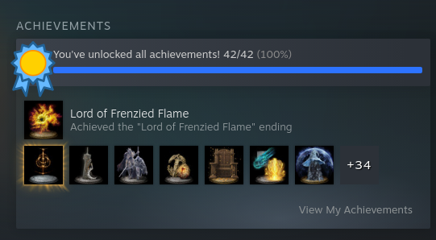

# Index Page

### Ein link
[[Eine seite]] 

!!! Note ein Block
jup ein block


### Eine Tabelle
ja | nein
--- | ---
x | x

### Ein Code Snippet
```abap
data: lv_string TYPE string.
print lv_string.
```

### Ein Bild



### Eine Liste
- [ ] 1 
- [ ] 2
- [ ] 3